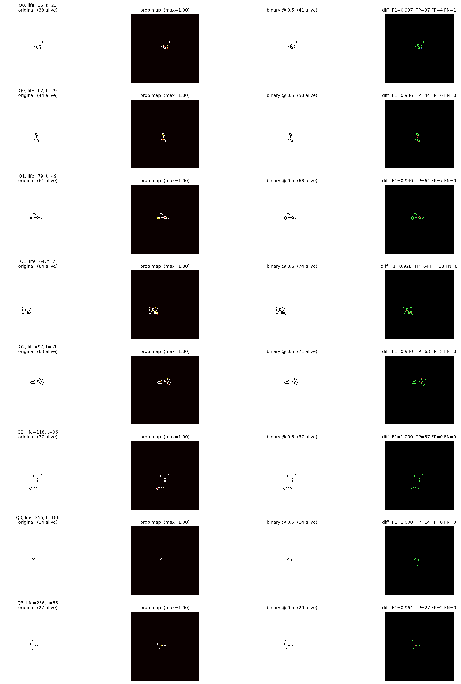

# What a faithful autoencoder of Conway's Game of Life does and does not represent

A convolutional autoencoder is trained to reconstruct Game of Life frames
near-exactly, then probed to find out what its latent space actually supports.
Because the Game of Life is deterministic and fully observable, the simulator
supplies exact ground truth for every question — so each claim here is a
measurement rather than an inference.

**The short version.** The model reconstructs real frames at **alive-F1 0.9169**
with round-trip cosine **0.999**. It is nonetheless *not* a substrate for
predicting dynamics, *not* a good behaviour descriptor, *not* translation
invariant, and *not* trustworthy off-manifold. The one thing it does well —
organising frames by pixel overlap — is exactly what its training objective
asked for, and is also the direct cause of most of the failures.

This repository is the code and measurement suite behind that study.

---

## The model

`128×128 binary grid → z ∈ ℝ¹⁰²⁴ → 128×128 logits`. A plain autoencoder: the
latent is a free real vector, softly bounded near unit norm.
**67,281,873 parameters, CPU-only training**, 150,000 steps (~30 h).

- **Encoder (tile-disjoint).** Three `kernel=2, stride=2` downsample stages
  (128→64→32→16) with `1×1` channel-mixing refine blocks, then a linear
  projection to ℝ¹⁰²⁴. Each of the 16×16 trunk positions sees exactly one
  disjoint 8×8 input tile — **no overlapping receptive fields**.
- **Decoder (halo-free).** Linear projection to 16×16×128, then three
  `PixelShuffle` 2× upsample stages with `kernel=1` convolutions and a final
  `1×1` conv. No layer mixes signal between adjacent output pixels, so the
  decoder cannot paint a probability "halo" around true cells.
- The **only** cross-tile path is the fully-connected projection through `z`.

Architecture rationale: [`design/03_final_architecture.md`](design/03_final_architecture.md).

### Losses

| Loss | Role |
|---|---|
| **L1** Reconstruction | BCE-with-logits, positive class weighted on a curriculum. Primary objective. |
| **L2** Smoothness | `cos(z_a, z_b) ≈ IoU(grid_a, grid_b)`, cosine clamped ≥ 0. **This loss sets the latent geometry, and therefore drives most of the results below.** |
| **L3** Soft norm bound | `(‖z‖² − 1)²` — keeps ‖z‖ near 1 without a hard constraint. |
| **L4** Angular uniformity | Spreads directions, preventing angular collapse. |

Three scheduled ingredients make the loss set converge from random init: a
`pos_weight` curriculum (50 → 5 over 10k steps) that breaks an otherwise-fatal
encoder collapse; an L3 warmup; and a geometry-weight decay to ×0.15 over steps
10k–30k so L1 owns the late gradient.

---

## Results

Every number is from checkpoint step 148,500. `a ± b` is mean ± s.d. over 5
seeds. Full detail, with the script that produces each figure:
**[`RESULTS.md`](RESULTS.md)**.

**Reconstruction.** alive-F1 **0.9169** (dead-F1 0.9997) on the full validation
set at threshold 0.5; **0.9305** at the optimal threshold 0.80. The residual
error is a sparsity artifact, not blur — 97.2% of true-alive pixels are
confidently alive, and 90.2% of false positives sit adjacent to a true live cell.

### What the latent supports

- **Faithful, stable encoding** — round-trip drift **0.034**, cosine **0.999**.
- **Organised by frame similarity** — mean latent cosine rises monotonically
  with IoU: 0.006 (disjoint) → 0.744 (IoU 0.2–0.35) → **0.958** (IoU > 0.7).

### What it does not

- **Dynamics do not linearize.** A learned `z_t → z_{t+1}` predictor collapses
  under closed-loop rollout — F1 **0.344 ± 0.011** at horizon 1 down to
  **0.009 ± 0.003** at horizon 60 — while the teacher-forced autoencoder ceiling
  stays **flat at 0.929–0.946** at every horizon. The representation holds the
  true state at step 60 perfectly well; the learned transition cannot reach it.
  Predicting no change beats the learned rollout at every horizon.
- **Appearance is not behaviour.** Classifying four never-trained behaviour
  classes from the frozen latent reaches **0.625 ± 0.012** balanced accuracy,
  against **0.842 ± 0.010** for nine hand-computed population statistics
  (chance 0.25). Caveat: those labels were plausibly defined using population
  heuristics, so the baseline is advantaged — read this as *no advantage*, not
  as *useless*.
- **Not translation invariant.** Displace an *identical* trajectory diagonally
  and latent cosine falls 1.000 → 0.700 (1 cell) → **0.294 (3 cells)**, against
  a cross-seed floor of 0.115 ± 0.207. Three cells is enough to make identical
  dynamics look unrelated. This follows directly from L2: it trains `cos → IoU`,
  and translated copies have IoU ≈ 0, so the model was taught to call them
  unrelated.
- **Competence is placement-bound.** Reconstruction F1 falls from 0.921 at the
  trained centre to 0.325 at the border, recall collapsing to 0.37–0.51 outside
  the training placement range.
- **Confident on invalid output.** Latents sampled from the prior at the
  training norm decode to **~6.7× the real live-cell density** (315–320 vs 47.8)
  while the decoder reports max-probability 1.000 and an ambiguous-pixel fraction
  of 0.024. **Decoder sharpness is not a validity signal.**

### One thing that works

Sub-frame motif detection — in the conv trunk, not in `z`. One flipped pixel
changes ~988 of `z`'s 1024 dimensions but exactly 1 of the trunk's 256 tile
positions. Scoring tiles by best cosine against a bank of a motif's trunk codes
at all 36 intra-tile offsets matches sliding-window template matching on clean
motifs and degrades more gracefully under corruption (glider, 2 of 9 cells
flipped: **0.919 ± 0.010** vs 0.846 ± 0.017). Template matching wins at 1
flipped cell.



---

## Using this repository

```bash
pip install -r requirements.txt
```

Everything runs on CPU. Scripts are flat and run from the repository root, e.g.
`python3 threshold_sweep.py`.

### To explore

`engine.py` is a standalone vectorised B3/S23 simulator with canonical
correctness checks. It needs no model, no checkpoint and no dataset:

```bash
python3 -c "import engine; engine.run_canonical_checks()"
python3 model.py     # architecture summary + receptive-field verification
```

`python3 model.py` verifies the tile-disjoint property directly: perturb one
input pixel, and exactly one of the 256 trunk positions changes while ~988 of
the 1024 latent dimensions do.

### To verify the results

> **The trained checkpoint is not currently published.** Every diagnostic loads
> `checkpoints/best.pt` — a 269 MB file that is not in this repository and not
> yet hosted anywhere. Until it is, the diagnostics cannot be re-run as written
> and the numbers above cannot be reproduced from this repository alone. The
> scripts, the exact protocols and the seed corpus *are* all here, so the
> measurements are fully specified and re-derivable by retraining
> (~30 h, CPU). Open an issue if you would like the checkpoint hosted.

The seed corpus is on
[Hugging Face](https://huggingface.co/datasets/themantralab/gol-emergence-pipeline);
place `seeds.npy` and `lifespans.npy` under `data/`. [`DATASET.md`](DATASET.md)
describes every file and which are actually consumed.

### To extend the study

The diagnostics are deliberately independent single-file scripts. Each loads the
checkpoint read-only and prints a self-describing report; nothing is shared
except `engine.py`, `data.py` and `model.py`. Copy one and edit it.

| Script | Measures |
|---|---|
| `threshold_sweep.py` | F1 vs decision threshold; calibration; density-vs-accuracy |
| `latent_organization.py` | Does latent cosine track frame IoU? Temporal decay |
| `dynamics_probe.py` | Cycle-consistency; closed-loop rollout vs the AE ceiling |
| `persistence_baseline.py` | Rollout vs a predict-no-change null model; data scaling |
| `trajectory_readiness.py` | Trajectory separability; the position confound |
| `n4_offset_curve.py` | Latent similarity vs translation distance |
| `probe_behavior_class.py` | Frozen latent vs population statistics on behaviour |
| `world_model_readiness.py` | Interpolation, perturbation, prior sampling |
| `motif_tolerance.py` | Sub-frame motif detection vs template matching |
| `multi_seed.py` | 5-seed error bars for the load-bearing measurements |
| `border_test.py` | Reconstruction F1 vs seed placement |
| `traj_cluster_demo.py` | Trajectory retrieval / clustering |
| `latent_diag.py` | Halo quantification; angular spread of the latent |
| `grad_budget.py` | Each loss's share of the encoder gradient norm |
| `visualize.py` | Reconstruction montages |
| `make_figures.py` | Figure generation (`$GOL_FIG_DIR`, default `figures/`) |

Training is resumable: `python3 train.py --resume --steps N`.

---

## Repository layout

```
engine.py                 GoL B3/S23 simulator (vectorised, canonical checks)
data.py                   TrainingSeedPool — stratified sampling over 1.5M seeds
model.py                  Encoder / Decoder (tile-disjoint, halo-free)
losses.py                 L1–L4 with their curricula and schedules
train.py                  Training loop (prefetching, resumable)
<diagnostics>.py          One script per measurement — see the table above
design/                   Architecture rationale
figures/                  Diagnostic output
data/                     Small metadata; large arrays on Hugging Face
DATASET.md                What each data file is, and which are consumed
RESULTS.md                Every measured number with its source script
```

## Citation

A paper describing this study is in preparation. Until it appears, please cite
this repository.
